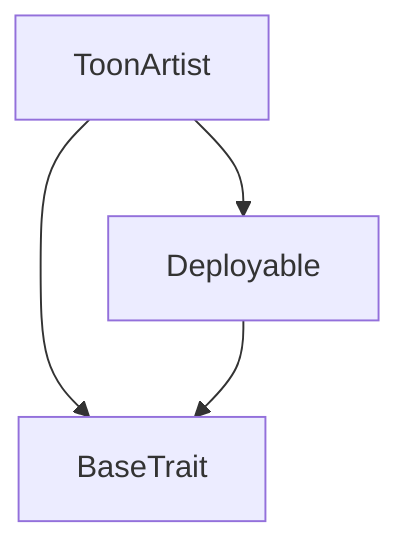

# Tact compilation report
Contract: ToonArtist
BoC Size: 1872 bytes

## Structures (Structs and Messages)
Total structures: 21

### DataSize
TL-B: `_ cells:int257 bits:int257 refs:int257 = DataSize`
Signature: `DataSize{cells:int257,bits:int257,refs:int257}`

### SignedBundle
TL-B: `_ signature:fixed_bytes64 signedData:remainder<slice> = SignedBundle`
Signature: `SignedBundle{signature:fixed_bytes64,signedData:remainder<slice>}`

### StateInit
TL-B: `_ code:^cell data:^cell = StateInit`
Signature: `StateInit{code:^cell,data:^cell}`

### Context
TL-B: `_ bounceable:bool sender:address value:int257 raw:^slice = Context`
Signature: `Context{bounceable:bool,sender:address,value:int257,raw:^slice}`

### SendParameters
TL-B: `_ mode:int257 body:Maybe ^cell code:Maybe ^cell data:Maybe ^cell value:int257 to:address bounce:bool = SendParameters`
Signature: `SendParameters{mode:int257,body:Maybe ^cell,code:Maybe ^cell,data:Maybe ^cell,value:int257,to:address,bounce:bool}`

### MessageParameters
TL-B: `_ mode:int257 body:Maybe ^cell value:int257 to:address bounce:bool = MessageParameters`
Signature: `MessageParameters{mode:int257,body:Maybe ^cell,value:int257,to:address,bounce:bool}`

### DeployParameters
TL-B: `_ mode:int257 body:Maybe ^cell value:int257 bounce:bool init:StateInit{code:^cell,data:^cell} = DeployParameters`
Signature: `DeployParameters{mode:int257,body:Maybe ^cell,value:int257,bounce:bool,init:StateInit{code:^cell,data:^cell}}`

### StdAddress
TL-B: `_ workchain:int8 address:uint256 = StdAddress`
Signature: `StdAddress{workchain:int8,address:uint256}`

### VarAddress
TL-B: `_ workchain:int32 address:^slice = VarAddress`
Signature: `VarAddress{workchain:int32,address:^slice}`

### BasechainAddress
TL-B: `_ hash:Maybe int257 = BasechainAddress`
Signature: `BasechainAddress{hash:Maybe int257}`

### Deploy
TL-B: `deploy#946a98b6 queryId:uint64 = Deploy`
Signature: `Deploy{queryId:uint64}`

### DeployOk
TL-B: `deploy_ok#aff90f57 queryId:uint64 = DeployOk`
Signature: `DeployOk{queryId:uint64}`

### FactoryDeploy
TL-B: `factory_deploy#6d0ff13b queryId:uint64 cashback:address = FactoryDeploy`
Signature: `FactoryDeploy{queryId:uint64,cashback:address}`

### RegisterArtist
TL-B: `register_artist#dfc5fbf5 artistContract:address = RegisterArtist`
Signature: `RegisterArtist{artistContract:address}`

### RegisterTrack
TL-B: `register_track#8cb4c243 trackId:uint256 fingerprint:uint256 trackContract:address = RegisterTrack`
Signature: `RegisterTrack{trackId:uint256,fingerprint:uint256,trackContract:address}`

### StakeToon
TL-B: `stake_toon#4435ea95 amount:coins = StakeToon`
Signature: `StakeToon{amount:coins}`

### UnstakeToon
TL-B: `unstake_toon#dfc52f97 amount:coins = UnstakeToon`
Signature: `UnstakeToon{amount:coins}`

### UpdateMetadata
TL-B: `update_metadata#1179e2f3 newUri:^string = UpdateMetadata`
Signature: `UpdateMetadata{newUri:^string}`

### AddTrack
TL-B: `add_track#21a5a79d trackId:uint256 fingerprint:uint256 trackContract:address = AddTrack`
Signature: `AddTrack{trackId:uint256,fingerprint:uint256,trackContract:address}`

### ArtistDetails
TL-B: `_ reputation:uint32 totalTipVolume:coins stakedToon:coins isActive:bool totalTracks:uint32 = ArtistDetails`
Signature: `ArtistDetails{reputation:uint32,totalTipVolume:coins,stakedToon:coins,isActive:bool,totalTracks:uint32}`

### ToonArtist$Data
TL-B: `_ owner:address registry:address telegramHash:uint256 metadataUri:^string reputation:uint32 totalTipVolume:coins stakedToon:coins tracks:dict<int, address> totalTracks:uint32 = ToonArtist`
Signature: `ToonArtist{owner:address,registry:address,telegramHash:uint256,metadataUri:^string,reputation:uint32,totalTipVolume:coins,stakedToon:coins,tracks:dict<int, address>,totalTracks:uint32}`

## Get methods
Total get methods: 8

## isActive
No arguments

## canLaunchToonDrop
No arguments

## getDetails
No arguments

## getTrack
Argument: trackId

## reputation
No arguments

## owner
No arguments

## totalTracks
No arguments

## stakedToon
No arguments

## Exit codes
* 2: Stack underflow
* 3: Stack overflow
* 4: Integer overflow
* 5: Integer out of expected range
* 6: Invalid opcode
* 7: Type check error
* 8: Cell overflow
* 9: Cell underflow
* 10: Dictionary error
* 11: 'Unknown' error
* 12: Fatal error
* 13: Out of gas error
* 14: Virtualization error
* 32: Action list is invalid
* 33: Action list is too long
* 34: Action is invalid or not supported
* 35: Invalid source address in outbound message
* 36: Invalid destination address in outbound message
* 37: Not enough Toncoin
* 38: Not enough extra currencies
* 39: Outbound message does not fit into a cell after rewriting
* 40: Cannot process a message
* 41: Library reference is null
* 42: Library change action error
* 43: Exceeded maximum number of cells in the library or the maximum depth of the Merkle tree
* 50: Account state size exceeded limits
* 128: Null reference exception
* 129: Invalid serialization prefix
* 130: Invalid incoming message
* 131: Constraints error
* 132: Access denied
* 133: Contract stopped
* 134: Invalid argument
* 135: Code of a contract was not found
* 136: Invalid standard address
* 138: Not a basechain address
* 6995: ToonArtist: stake required for additional tracks
* 9033: ToonArtist: stake amount must be positive
* 17513: ToonArtist: invalid track contract address
* 33141: ToonArtist: only owner can stake
* 34415: ToonArtist: only owner can update metadata
* 36510: ToonArtist: only owner can unstake
* 42813: ToonArtist: empty metadata URI
* 44170: ToonArtist: only owner can add tracks
* 59865: ToonArtist: insufficient stake

## Trait inheritance diagram

## Contract dependency diagram

