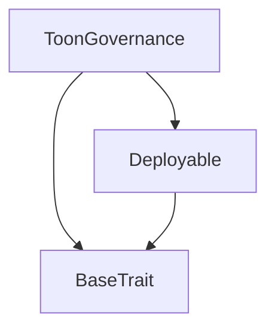
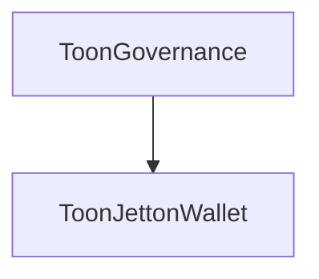

# Tact compilation report
Contract: ToonGovernance
BoC Size: 5082 bytes

## Structures (Structs and Messages)
Total structures: 38

### DataSize
TL-B: `_ cells:int257 bits:int257 refs:int257 = DataSize`
Signature: `DataSize{cells:int257,bits:int257,refs:int257}`

### SignedBundle
TL-B: `_ signature:fixed_bytes64 signedData:remainder<slice> = SignedBundle`
Signature: `SignedBundle{signature:fixed_bytes64,signedData:remainder<slice>}`

### StateInit
TL-B: `_ code:^cell data:^cell = StateInit`
Signature: `StateInit{code:^cell,data:^cell}`

### Context
TL-B: `_ bounceable:bool sender:address value:int257 raw:^slice = Context`
Signature: `Context{bounceable:bool,sender:address,value:int257,raw:^slice}`

### SendParameters
TL-B: `_ mode:int257 body:Maybe ^cell code:Maybe ^cell data:Maybe ^cell value:int257 to:address bounce:bool = SendParameters`
Signature: `SendParameters{mode:int257,body:Maybe ^cell,code:Maybe ^cell,data:Maybe ^cell,value:int257,to:address,bounce:bool}`

### MessageParameters
TL-B: `_ mode:int257 body:Maybe ^cell value:int257 to:address bounce:bool = MessageParameters`
Signature: `MessageParameters{mode:int257,body:Maybe ^cell,value:int257,to:address,bounce:bool}`

### DeployParameters
TL-B: `_ mode:int257 body:Maybe ^cell value:int257 bounce:bool init:StateInit{code:^cell,data:^cell} = DeployParameters`
Signature: `DeployParameters{mode:int257,body:Maybe ^cell,value:int257,bounce:bool,init:StateInit{code:^cell,data:^cell}}`

### StdAddress
TL-B: `_ workchain:int8 address:uint256 = StdAddress`
Signature: `StdAddress{workchain:int8,address:uint256}`

### VarAddress
TL-B: `_ workchain:int32 address:^slice = VarAddress`
Signature: `VarAddress{workchain:int32,address:^slice}`

### BasechainAddress
TL-B: `_ hash:Maybe int257 = BasechainAddress`
Signature: `BasechainAddress{hash:Maybe int257}`

### Deploy
TL-B: `deploy#946a98b6 queryId:uint64 = Deploy`
Signature: `Deploy{queryId:uint64}`

### DeployOk
TL-B: `deploy_ok#aff90f57 queryId:uint64 = DeployOk`
Signature: `DeployOk{queryId:uint64}`

### FactoryDeploy
TL-B: `factory_deploy#6d0ff13b queryId:uint64 cashback:address = FactoryDeploy`
Signature: `FactoryDeploy{queryId:uint64,cashback:address}`

### JettonData
TL-B: `_ totalSupply:int257 mintable:bool adminAddress:address content:^cell walletCode:^cell = JettonData`
Signature: `JettonData{totalSupply:int257,mintable:bool,adminAddress:address,content:^cell,walletCode:^cell}`

### TokenTransfer
TL-B: `token_transfer#0f8a7ea5 queryId:uint64 amount:coins destination:address response_destination:address customPayload:Maybe ^cell forward_ton_amount:coins forward_payload:remainder<slice> = TokenTransfer`
Signature: `TokenTransfer{queryId:uint64,amount:coins,destination:address,response_destination:address,customPayload:Maybe ^cell,forward_ton_amount:coins,forward_payload:remainder<slice>}`

### TokenMint
TL-B: `token_mint#1674b0a0 queryId:uint64 amount:coins receiver:address = TokenMint`
Signature: `TokenMint{queryId:uint64,amount:coins,receiver:address}`

### TokenTransferInternal
TL-B: `token_transfer_internal#178d4519 queryId:uint64 amount:coins from:address response_destination:address forward_ton_amount:coins forward_payload:remainder<slice> = TokenTransferInternal`
Signature: `TokenTransferInternal{queryId:uint64,amount:coins,from:address,response_destination:address,forward_ton_amount:coins,forward_payload:remainder<slice>}`

### TokenNotification
TL-B: `token_notification#7362d09c queryId:uint64 amount:coins from:address forward_payload:remainder<slice> = TokenNotification`
Signature: `TokenNotification{queryId:uint64,amount:coins,from:address,forward_payload:remainder<slice>}`

### TokenBurn
TL-B: `token_burn#595f07bc queryId:uint64 amount:coins response_destination:address = TokenBurn`
Signature: `TokenBurn{queryId:uint64,amount:coins,response_destination:address}`

### TokenBurnNotification
TL-B: `token_burn_notification#7bdd97de queryId:uint64 amount:coins owner:address response_destination:address = TokenBurnNotification`
Signature: `TokenBurnNotification{queryId:uint64,amount:coins,owner:address,response_destination:address}`

### TokenExcesses
TL-B: `token_excesses#d53276db queryId:uint64 = TokenExcesses`
Signature: `TokenExcesses{queryId:uint64}`

### UpdateMintAuthority
TL-B: `update_mint_authority#787cca54 newAuthority:address = UpdateMintAuthority`
Signature: `UpdateMintAuthority{newAuthority:address}`

### UpdateMetadata
TL-B: `update_metadata#1179e2f3 newUri:^string = UpdateMetadata`
Signature: `UpdateMetadata{newUri:^string}`

### ToonJettonMaster$Data
TL-B: `_ owner:address mintAuthority:address totalSupply:coins metadataUri:^string = ToonJettonMaster`
Signature: `ToonJettonMaster{owner:address,mintAuthority:address,totalSupply:coins,metadataUri:^string}`

### ToonJettonWallet$Data
TL-B: `_ balance:coins owner:address master:address = ToonJettonWallet`
Signature: `ToonJettonWallet{balance:coins,owner:address,master:address}`

### UnstakeGovernance
TL-B: `unstake_governance#03686687 amount:coins = UnstakeGovernance`
Signature: `UnstakeGovernance{amount:coins}`

### ProposeParameterUpdate
TL-B: `propose_parameter_update#bba923e1 parameter:^string newValue:uint64 description:^string = ProposeParameterUpdate`
Signature: `ProposeParameterUpdate{parameter:^string,newValue:uint64,description:^string}`

### ProposeAddressUpdate
TL-B: `propose_address_update#59d0887c parameter:^string newAddress:address description:^string = ProposeAddressUpdate`
Signature: `ProposeAddressUpdate{parameter:^string,newAddress:address,description:^string}`

### VoteOnProposal
TL-B: `vote_on_proposal#c4dbca40 proposalId:uint256 support:bool = VoteOnProposal`
Signature: `VoteOnProposal{proposalId:uint256,support:bool}`

### VoteOnAddressProposal
TL-B: `vote_on_address_proposal#7c14af8e proposalId:uint256 support:bool = VoteOnAddressProposal`
Signature: `VoteOnAddressProposal{proposalId:uint256,support:bool}`

### ExecuteProposal
TL-B: `execute_proposal#e47ed13b proposalId:uint256 = ExecuteProposal`
Signature: `ExecuteProposal{proposalId:uint256}`

### ExecuteAddressProposal
TL-B: `execute_address_proposal#81a594dc proposalId:uint256 = ExecuteAddressProposal`
Signature: `ExecuteAddressProposal{proposalId:uint256}`

### Configuration
TL-B: `_ emissionCap:coins minWalletAgeDays:uint32 targetDailyActivity:uint32 rewardBaseActiveListener:coins rewardBaseGrowthAgent:coins rewardBaseArtistLaunch:coins rewardBaseTrendsetter:coins rewardBaseEarlyBeliever:coins rewardBaseDropInvestor:coins decayFactor:uint16 minThreshold:coins antiFarmingCoeff:uint16 = Configuration`
Signature: `Configuration{emissionCap:coins,minWalletAgeDays:uint32,targetDailyActivity:uint32,rewardBaseActiveListener:coins,rewardBaseGrowthAgent:coins,rewardBaseArtistLaunch:coins,rewardBaseTrendsetter:coins,rewardBaseEarlyBeliever:coins,rewardBaseDropInvestor:coins,decayFactor:uint16,minThreshold:coins,antiFarmingCoeff:uint16}`

### SetConfig
TL-B: `set_config#2bd0b755 config:Configuration{emissionCap:coins,minWalletAgeDays:uint32,targetDailyActivity:uint32,rewardBaseActiveListener:coins,rewardBaseGrowthAgent:coins,rewardBaseArtistLaunch:coins,rewardBaseTrendsetter:coins,rewardBaseEarlyBeliever:coins,rewardBaseDropInvestor:coins,decayFactor:uint16,minThreshold:coins,antiFarmingCoeff:uint16} = SetConfig`
Signature: `SetConfig{config:Configuration{emissionCap:coins,minWalletAgeDays:uint32,targetDailyActivity:uint32,rewardBaseActiveListener:coins,rewardBaseGrowthAgent:coins,rewardBaseArtistLaunch:coins,rewardBaseTrendsetter:coins,rewardBaseEarlyBeliever:coins,rewardBaseDropInvestor:coins,decayFactor:uint16,minThreshold:coins,antiFarmingCoeff:uint16}}`

### UpdateConfigParam
TL-B: `update_config_param#0e849a55 parameter:^string newValue:uint64 = UpdateConfigParam`
Signature: `UpdateConfigParam{parameter:^string,newValue:uint64}`

### GlobalProposal
TL-B: `_ parameter:^string newValue:uint64 description:^string proposer:address votesFor:coins votesAgainst:coins deadline:uint32 executed:bool = GlobalProposal`
Signature: `GlobalProposal{parameter:^string,newValue:uint64,description:^string,proposer:address,votesFor:coins,votesAgainst:coins,deadline:uint32,executed:bool}`

### AddressProposal
TL-B: `_ parameter:^string newAddress:address description:^string proposer:address votesFor:coins votesAgainst:coins deadline:uint32 executed:bool = AddressProposal`
Signature: `AddressProposal{parameter:^string,newAddress:address,description:^string,proposer:address,votesFor:coins,votesAgainst:coins,deadline:uint32,executed:bool}`

### ToonGovernance$Data
TL-B: `_ registry:address vault:address jettonMaster:address stakes:dict<address, int> totalStaked:coins proposals:dict<int, ^GlobalProposal{parameter:^string,newValue:uint64,description:^string,proposer:address,votesFor:coins,votesAgainst:coins,deadline:uint32,executed:bool}> nextProposalId:uint256 addressProposals:dict<int, ^AddressProposal{parameter:^string,newAddress:address,description:^string,proposer:address,votesFor:coins,votesAgainst:coins,deadline:uint32,executed:bool}> nextAddressProposalId:uint256 hasVoted:dict<int, bool> hasVotedAddress:dict<int, bool> = ToonGovernance`
Signature: `ToonGovernance{registry:address,vault:address,jettonMaster:address,stakes:dict<address, int>,totalStaked:coins,proposals:dict<int, ^GlobalProposal{parameter:^string,newValue:uint64,description:^string,proposer:address,votesFor:coins,votesAgainst:coins,deadline:uint32,executed:bool}>,nextProposalId:uint256,addressProposals:dict<int, ^AddressProposal{parameter:^string,newAddress:address,description:^string,proposer:address,votesFor:coins,votesAgainst:coins,deadline:uint32,executed:bool}>,nextAddressProposalId:uint256,hasVoted:dict<int, bool>,hasVotedAddress:dict<int, bool>}`

## Get methods
Total get methods: 7

## totalStaked
No arguments

## stake
Argument: voter

## getProposal
Argument: proposalId

## getAddressProposal
Argument: proposalId

## hasAddressVoted
Argument: proposalId
Argument: voter

## hasAddressVotedOnAddressProposal
Argument: proposalId
Argument: voter

## quorumMet
Argument: proposalId

## Exit codes
* 2: Stack underflow
* 3: Stack overflow
* 4: Integer overflow
* 5: Integer out of expected range
* 6: Invalid opcode
* 7: Type check error
* 8: Cell overflow
* 9: Cell underflow
* 10: Dictionary error
* 11: 'Unknown' error
* 12: Fatal error
* 13: Out of gas error
* 14: Virtualization error
* 32: Action list is invalid
* 33: Action list is too long
* 34: Action is invalid or not supported
* 35: Invalid source address in outbound message
* 36: Invalid destination address in outbound message
* 37: Not enough Toncoin
* 38: Not enough extra currencies
* 39: Outbound message does not fit into a cell after rewriting
* 40: Cannot process a message
* 41: Library reference is null
* 42: Library change action error
* 43: Exceeded maximum number of cells in the library or the maximum depth of the Merkle tree
* 50: Account state size exceeded limits
* 128: Null reference exception
* 129: Invalid serialization prefix
* 130: Invalid incoming message
* 131: Constraints error
* 132: Access denied
* 133: Contract stopped
* 134: Invalid argument
* 135: Code of a contract was not found
* 136: Invalid standard address
* 138: Not a basechain address
* 2223: ToonGovernance: unauthorized Jetton notification
* 2999: ToonGovernance: quorum not met
* 4429: Invalid sender
* 9622: ToonGovernance: already executed
* 14534: Not owner
* 22462: ToonGovernance: already voted on this proposal
* 25644: Only ToonVault can mint
* 26849: ToonGovernance: voting closed
* 33397: ToonGovernance: address proposal does not exist
* 34393: Unauthorized burn notification
* 36734: ToonGovernance: unknown numeric parameter
* 37276: ToonGovernance: voting still open
* 39639: ToonGovernance: proposal does not exist
* 53903: ToonGovernance: unknown address parameter
* 54615: Insufficient balance
* 61996: ToonGovernance: no voting weight
* 63274: ToonGovernance: insufficient stake
* 63731: ToonGovernance: must stake to propose

## Trait inheritance diagram

## Contract dependency diagram

