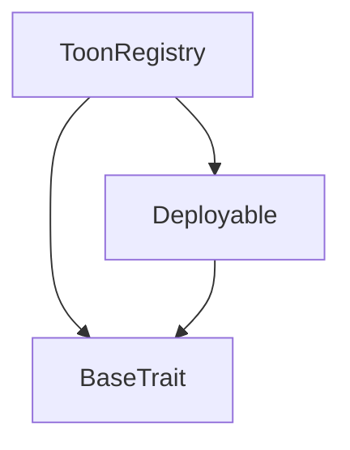
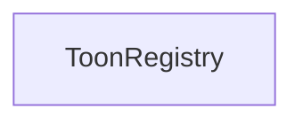

# Tact compilation report
Contract: ToonRegistry
BoC Size: 7015 bytes

## Structures (Structs and Messages)
Total structures: 43

### DataSize
TL-B: `_ cells:int257 bits:int257 refs:int257 = DataSize`
Signature: `DataSize{cells:int257,bits:int257,refs:int257}`

### SignedBundle
TL-B: `_ signature:fixed_bytes64 signedData:remainder<slice> = SignedBundle`
Signature: `SignedBundle{signature:fixed_bytes64,signedData:remainder<slice>}`

### StateInit
TL-B: `_ code:^cell data:^cell = StateInit`
Signature: `StateInit{code:^cell,data:^cell}`

### Context
TL-B: `_ bounceable:bool sender:address value:int257 raw:^slice = Context`
Signature: `Context{bounceable:bool,sender:address,value:int257,raw:^slice}`

### SendParameters
TL-B: `_ mode:int257 body:Maybe ^cell code:Maybe ^cell data:Maybe ^cell value:int257 to:address bounce:bool = SendParameters`
Signature: `SendParameters{mode:int257,body:Maybe ^cell,code:Maybe ^cell,data:Maybe ^cell,value:int257,to:address,bounce:bool}`

### MessageParameters
TL-B: `_ mode:int257 body:Maybe ^cell value:int257 to:address bounce:bool = MessageParameters`
Signature: `MessageParameters{mode:int257,body:Maybe ^cell,value:int257,to:address,bounce:bool}`

### DeployParameters
TL-B: `_ mode:int257 body:Maybe ^cell value:int257 bounce:bool init:StateInit{code:^cell,data:^cell} = DeployParameters`
Signature: `DeployParameters{mode:int257,body:Maybe ^cell,value:int257,bounce:bool,init:StateInit{code:^cell,data:^cell}}`

### StdAddress
TL-B: `_ workchain:int8 address:uint256 = StdAddress`
Signature: `StdAddress{workchain:int8,address:uint256}`

### VarAddress
TL-B: `_ workchain:int32 address:^slice = VarAddress`
Signature: `VarAddress{workchain:int32,address:^slice}`

### BasechainAddress
TL-B: `_ hash:Maybe int257 = BasechainAddress`
Signature: `BasechainAddress{hash:Maybe int257}`

### Deploy
TL-B: `deploy#946a98b6 queryId:uint64 = Deploy`
Signature: `Deploy{queryId:uint64}`

### DeployOk
TL-B: `deploy_ok#aff90f57 queryId:uint64 = DeployOk`
Signature: `DeployOk{queryId:uint64}`

### FactoryDeploy
TL-B: `factory_deploy#6d0ff13b queryId:uint64 cashback:address = FactoryDeploy`
Signature: `FactoryDeploy{queryId:uint64,cashback:address}`

### RegisterArtist
TL-B: `register_artist#dfc5fbf5 artistContract:address = RegisterArtist`
Signature: `RegisterArtist{artistContract:address}`

### RegisterTrack
TL-B: `register_track#8cb4c243 trackId:uint256 fingerprint:uint256 trackContract:address = RegisterTrack`
Signature: `RegisterTrack{trackId:uint256,fingerprint:uint256,trackContract:address}`

### AuthorizeMint
TL-B: `authorize_mint#de13870d recipient:address amount:coins = AuthorizeMint`
Signature: `AuthorizeMint{recipient:address,amount:coins}`

### StageArtistRegistration
TL-B: `stage_artist_registration#cc4fedf7 artistContract:address wallet:address = StageArtistRegistration`
Signature: `StageArtistRegistration{artistContract:address,wallet:address}`

### ConfirmArtistRegistration
TL-B: `confirm_artist_registration#c8526e47 wallet:address = ConfirmArtistRegistration`
Signature: `ConfirmArtistRegistration{wallet:address}`

### ArtistRegistrationConfirmed
TL-B: `artist_registration_confirmed#0954aef8 wallet:address = ArtistRegistrationConfirmed`
Signature: `ArtistRegistrationConfirmed{wallet:address}`

### RollbackArtistRegistration
TL-B: `rollback_artist_registration#e59974c3 wallet:address = RollbackArtistRegistration`
Signature: `RollbackArtistRegistration{wallet:address}`

### StageTrackRegistration
TL-B: `stage_track_registration#c09310ed trackId:uint256 fingerprint:uint256 trackContract:address = StageTrackRegistration`
Signature: `StageTrackRegistration{trackId:uint256,fingerprint:uint256,trackContract:address}`

### TrackStagingAccepted
TL-B: `track_staging_accepted#d40bb4a9 trackId:uint256 = TrackStagingAccepted`
Signature: `TrackStagingAccepted{trackId:uint256}`

### ConfirmTrackRegistration
TL-B: `confirm_track_registration#a47a6dee trackId:uint256 = ConfirmTrackRegistration`
Signature: `ConfirmTrackRegistration{trackId:uint256}`

### TrackRegistrationConfirmed
TL-B: `track_registration_confirmed#6a21f0df trackId:uint256 = TrackRegistrationConfirmed`
Signature: `TrackRegistrationConfirmed{trackId:uint256}`

### RollbackTrackRegistration
TL-B: `rollback_track_registration#73360001 trackId:uint256 = RollbackTrackRegistration`
Signature: `RollbackTrackRegistration{trackId:uint256}`

### UpdateMintAuthority
TL-B: `update_mint_authority#787cca54 newAuthority:address = UpdateMintAuthority`
Signature: `UpdateMintAuthority{newAuthority:address}`

### UpdateVaultAddress
TL-B: `update_vault_address#db77da3f newVault:address = UpdateVaultAddress`
Signature: `UpdateVaultAddress{newVault:address}`

### RequestMint
TL-B: `request_mint#10859351 recipient:address amount:coins = RequestMint`
Signature: `RequestMint{recipient:address,amount:coins}`

### SetConfig
TL-B: `set_config#2bd0b755 config:Configuration{emissionCap:coins,minWalletAgeDays:uint32,targetDailyActivity:uint32,rewardBaseActiveListener:coins,rewardBaseGrowthAgent:coins,rewardBaseArtistLaunch:coins,rewardBaseTrendsetter:coins,rewardBaseEarlyBeliever:coins,rewardBaseDropInvestor:coins,decayFactor:uint16,minThreshold:coins,antiFarmingCoeff:uint16} = SetConfig`
Signature: `SetConfig{config:Configuration{emissionCap:coins,minWalletAgeDays:uint32,targetDailyActivity:uint32,rewardBaseActiveListener:coins,rewardBaseGrowthAgent:coins,rewardBaseArtistLaunch:coins,rewardBaseTrendsetter:coins,rewardBaseEarlyBeliever:coins,rewardBaseDropInvestor:coins,decayFactor:uint16,minThreshold:coins,antiFarmingCoeff:uint16}}`

### SetVersion
TL-B: `set_version#03958d4f newVersion:uint32 = SetVersion`
Signature: `SetVersion{newVersion:uint32}`

### SetTrackRewardEligibility
TL-B: `set_track_reward_eligibility#09278fbd trackId:uint256 eligible:bool = SetTrackRewardEligibility`
Signature: `SetTrackRewardEligibility{trackId:uint256,eligible:bool}`

### SetArtistRewardEligibility
TL-B: `set_artist_reward_eligibility#9cd7d62c artist:address eligible:bool = SetArtistRewardEligibility`
Signature: `SetArtistRewardEligibility{artist:address,eligible:bool}`

### UpdateConfigParam
TL-B: `update_config_param#0e849a55 parameter:^string newValue:uint64 = UpdateConfigParam`
Signature: `UpdateConfigParam{parameter:^string,newValue:uint64}`

### PendingArtist
TL-B: `_ wallet:address artistContract:address timestamp:uint32 = PendingArtist`
Signature: `PendingArtist{wallet:address,artistContract:address,timestamp:uint32}`

### PendingTrack
TL-B: `_ trackId:uint256 fingerprint:uint256 trackContract:address timestamp:uint32 = PendingTrack`
Signature: `PendingTrack{trackId:uint256,fingerprint:uint256,trackContract:address,timestamp:uint32}`

### Configuration
TL-B: `_ emissionCap:coins minWalletAgeDays:uint32 targetDailyActivity:uint32 rewardBaseActiveListener:coins rewardBaseGrowthAgent:coins rewardBaseArtistLaunch:coins rewardBaseTrendsetter:coins rewardBaseEarlyBeliever:coins rewardBaseDropInvestor:coins decayFactor:uint16 minThreshold:coins antiFarmingCoeff:uint16 = Configuration`
Signature: `Configuration{emissionCap:coins,minWalletAgeDays:uint32,targetDailyActivity:uint32,rewardBaseActiveListener:coins,rewardBaseGrowthAgent:coins,rewardBaseArtistLaunch:coins,rewardBaseTrendsetter:coins,rewardBaseEarlyBeliever:coins,rewardBaseDropInvestor:coins,decayFactor:uint16,minThreshold:coins,antiFarmingCoeff:uint16}`

### ArtistRegistered
TL-B: `artist_registered#e2af76f9 wallet:address artistContract:address registeredAt:uint32 = ArtistRegistered`
Signature: `ArtistRegistered{wallet:address,artistContract:address,registeredAt:uint32}`

### TrackRegistered
TL-B: `track_registered#74e4a736 trackId:uint256 fingerprint:uint256 trackContract:address registeredAt:uint32 = TrackRegistered`
Signature: `TrackRegistered{trackId:uint256,fingerprint:uint256,trackContract:address,registeredAt:uint32}`

### MintAuthorized
TL-B: `mint_authorized#fa1d125c recipient:address amount:coins authorizedAt:uint32 = MintAuthorized`
Signature: `MintAuthorized{recipient:address,amount:coins,authorizedAt:uint32}`

### RegisterDrop
TL-B: `register_drop#a99ec9f7 trackId:uint256 dropContract:address = RegisterDrop`
Signature: `RegisterDrop{trackId:uint256,dropContract:address}`

### SetPaused
TL-B: `set_paused#096819ff paused:bool = SetPaused`
Signature: `SetPaused{paused:bool}`

### DropRegistered
TL-B: `drop_registered#5206fbd1 trackId:uint256 dropContract:address registeredAt:uint32 = DropRegistered`
Signature: `DropRegistered{trackId:uint256,dropContract:address,registeredAt:uint32}`

### ToonRegistry$Data
TL-B: `_ artists:dict<address, address> artistContracts:dict<address, address> tracks:dict<int, address> trackContracts:dict<address, int> drops:dict<int, address> fingerprints:dict<int, bool> mintAuthority:address vault:address isPaused:bool config:Configuration{emissionCap:coins,minWalletAgeDays:uint32,targetDailyActivity:uint32,rewardBaseActiveListener:coins,rewardBaseGrowthAgent:coins,rewardBaseArtistLaunch:coins,rewardBaseTrendsetter:coins,rewardBaseEarlyBeliever:coins,rewardBaseDropInvestor:coins,decayFactor:uint16,minThreshold:coins,antiFarmingCoeff:uint16} version:uint32 trackRewardEligible:dict<int, bool> artistRewardEligible:dict<address, bool> pendingArtists:dict<address, ^PendingArtist{wallet:address,artistContract:address,timestamp:uint32}> pendingTracks:dict<int, ^PendingTrack{trackId:uint256,fingerprint:uint256,trackContract:address,timestamp:uint32}> totalArtists:uint32 totalTracks:uint32 = ToonRegistry`
Signature: `ToonRegistry{artists:dict<address, address>,artistContracts:dict<address, address>,tracks:dict<int, address>,trackContracts:dict<address, int>,drops:dict<int, address>,fingerprints:dict<int, bool>,mintAuthority:address,vault:address,isPaused:bool,config:Configuration{emissionCap:coins,minWalletAgeDays:uint32,targetDailyActivity:uint32,rewardBaseActiveListener:coins,rewardBaseGrowthAgent:coins,rewardBaseArtistLaunch:coins,rewardBaseTrendsetter:coins,rewardBaseEarlyBeliever:coins,rewardBaseDropInvestor:coins,decayFactor:uint16,minThreshold:coins,antiFarmingCoeff:uint16},version:uint32,trackRewardEligible:dict<int, bool>,artistRewardEligible:dict<address, bool>,pendingArtists:dict<address, ^PendingArtist{wallet:address,artistContract:address,timestamp:uint32}>,pendingTracks:dict<int, ^PendingTrack{trackId:uint256,fingerprint:uint256,trackContract:address,timestamp:uint32}>,totalArtists:uint32,totalTracks:uint32}`

## Get methods
Total get methods: 11

## getArtistContract
Argument: wallet

## getTrackContract
Argument: trackId

## getDropContract
Argument: trackId

## isRegisteredArtist
Argument: wallet

## isRegisteredTrack
Argument: trackId

## fingerprintExists
Argument: fingerprint

## getMintAuthority
No arguments

## getConfig
No arguments

## getVersion
No arguments

## isTrackRewardEligible
Argument: trackId

## isArtistRewardEligible
Argument: artist

## Exit codes
* 2: Stack underflow
* 3: Stack overflow
* 4: Integer overflow
* 5: Integer out of expected range
* 6: Invalid opcode
* 7: Type check error
* 8: Cell overflow
* 9: Cell underflow
* 10: Dictionary error
* 11: 'Unknown' error
* 12: Fatal error
* 13: Out of gas error
* 14: Virtualization error
* 32: Action list is invalid
* 33: Action list is too long
* 34: Action is invalid or not supported
* 35: Invalid source address in outbound message
* 36: Invalid destination address in outbound message
* 37: Not enough Toncoin
* 38: Not enough extra currencies
* 39: Outbound message does not fit into a cell after rewriting
* 40: Cannot process a message
* 41: Library reference is null
* 42: Library change action error
* 43: Exceeded maximum number of cells in the library or the maximum depth of the Merkle tree
* 50: Account state size exceeded limits
* 128: Null reference exception
* 129: Invalid serialization prefix
* 130: Invalid incoming message
* 131: Constraints error
* 132: Access denied
* 133: Contract stopped
* 134: Invalid argument
* 135: Code of a contract was not found
* 136: Invalid standard address
* 138: Not a basechain address
* 4821: ToonRegistry: rollback not allowed yet
* 9299: ToonRegistry: wallet already has an artist identity
* 9580: ToonRegistry: mint amount must be positive
* 14803: ToonRegistry: unauthorized confirmation
* 15016: ToonRegistry: duplicate content fingerprint detected
* 16165: ToonRegistry: trackId already exists
* 17021: ToonRegistry: no pending track found
* 18543: ToonRegistry: trackId cannot be zero
* 26225: ToonRegistry: caller is not a registered ToonArtist contract
* 27890: ToonRegistry: caller is not the mint authority
* 28295: ToonRegistry: only mint authority can update eligibility
* 31774: ToonRegistry: invalid new authority address
* 38383: ToonRegistry: only mint authority can update config
* 38991: ToonRegistry: invalid recipient address
* 44318: ToonRegistry: drop already exists for this track
* 47432: ToonRegistry: invalid drop contract address
* 48236: ToonRegistry: only mint authority can update version
* 50582: ToonRegistry: caller is not a registered ToonTrack contract
* 55621: ToonRegistry: invalid artist contract address
* 56923: ToonRegistry: no pending registration found
* 57050: ToonRegistry: registration already pending
* 57962: ToonRegistry: invalid vault address
* 58583: ToonRegistry: track registration already pending

## Trait inheritance diagram

## Contract dependency diagram

