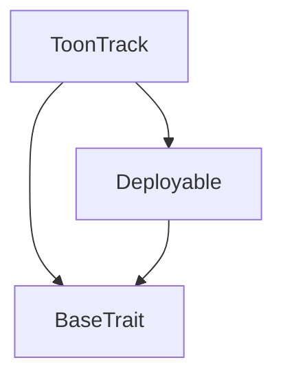

# Tact compilation report
Contract: ToonTrack
BoC Size: 1840 bytes

## Structures (Structs and Messages)
Total structures: 20

### DataSize
TL-B: `_ cells:int257 bits:int257 refs:int257 = DataSize`
Signature: `DataSize{cells:int257,bits:int257,refs:int257}`

### SignedBundle
TL-B: `_ signature:fixed_bytes64 signedData:remainder<slice> = SignedBundle`
Signature: `SignedBundle{signature:fixed_bytes64,signedData:remainder<slice>}`

### StateInit
TL-B: `_ code:^cell data:^cell = StateInit`
Signature: `StateInit{code:^cell,data:^cell}`

### Context
TL-B: `_ bounceable:bool sender:address value:int257 raw:^slice = Context`
Signature: `Context{bounceable:bool,sender:address,value:int257,raw:^slice}`

### SendParameters
TL-B: `_ mode:int257 body:Maybe ^cell code:Maybe ^cell data:Maybe ^cell value:int257 to:address bounce:bool = SendParameters`
Signature: `SendParameters{mode:int257,body:Maybe ^cell,code:Maybe ^cell,data:Maybe ^cell,value:int257,to:address,bounce:bool}`

### MessageParameters
TL-B: `_ mode:int257 body:Maybe ^cell value:int257 to:address bounce:bool = MessageParameters`
Signature: `MessageParameters{mode:int257,body:Maybe ^cell,value:int257,to:address,bounce:bool}`

### DeployParameters
TL-B: `_ mode:int257 body:Maybe ^cell value:int257 bounce:bool init:StateInit{code:^cell,data:^cell} = DeployParameters`
Signature: `DeployParameters{mode:int257,body:Maybe ^cell,value:int257,bounce:bool,init:StateInit{code:^cell,data:^cell}}`

### StdAddress
TL-B: `_ workchain:int8 address:uint256 = StdAddress`
Signature: `StdAddress{workchain:int8,address:uint256}`

### VarAddress
TL-B: `_ workchain:int32 address:^slice = VarAddress`
Signature: `VarAddress{workchain:int32,address:^slice}`

### BasechainAddress
TL-B: `_ hash:Maybe int257 = BasechainAddress`
Signature: `BasechainAddress{hash:Maybe int257}`

### Deploy
TL-B: `deploy#946a98b6 queryId:uint64 = Deploy`
Signature: `Deploy{queryId:uint64}`

### DeployOk
TL-B: `deploy_ok#aff90f57 queryId:uint64 = DeployOk`
Signature: `DeployOk{queryId:uint64}`

### FactoryDeploy
TL-B: `factory_deploy#6d0ff13b queryId:uint64 cashback:address = FactoryDeploy`
Signature: `FactoryDeploy{queryId:uint64,cashback:address}`

### AuthorizeMint
TL-B: `authorize_mint#de13870d recipient:address amount:coins = AuthorizeMint`
Signature: `AuthorizeMint{recipient:address,amount:coins}`

### RequestMint
TL-B: `request_mint#10859351 recipient:address amount:coins = RequestMint`
Signature: `RequestMint{recipient:address,amount:coins}`

### ConfirmTrackRegistration
TL-B: `confirm_track_registration#a47a6dee trackId:uint256 = ConfirmTrackRegistration`
Signature: `ConfirmTrackRegistration{trackId:uint256}`

### TrackRegistrationConfirmed
TL-B: `track_registration_confirmed#6a21f0df trackId:uint256 = TrackRegistrationConfirmed`
Signature: `TrackRegistrationConfirmed{trackId:uint256}`

### TrackRegistrationFinalized
TL-B: `track_registration_finalized#b2c8fdba trackId:uint256 trackContract:address = TrackRegistrationFinalized`
Signature: `TrackRegistrationFinalized{trackId:uint256,trackContract:address}`

### MintConfirmed
TL-B: `mint_confirmed#1bf9e8a5 recipient:address amount:coins origin:address = MintConfirmed`
Signature: `MintConfirmed{recipient:address,amount:coins,origin:address}`

### ToonTrack$Data
TL-B: `_ artist:address registry:address trackId:uint256 metadataUri:^string fingerprint:uint256 mintFee:coins reputation:uint32 isRegistered:bool = ToonTrack`
Signature: `ToonTrack{artist:address,registry:address,trackId:uint256,metadataUri:^string,fingerprint:uint256,mintFee:coins,reputation:uint32,isRegistered:bool}`

## Get methods
Total get methods: 6

## isRegistered
No arguments

## reputation
No arguments

## artist
No arguments

## metadataUri
No arguments

## fingerprint
No arguments

## mintFee
No arguments

## Exit codes
* 2: Stack underflow
* 3: Stack overflow
* 4: Integer overflow
* 5: Integer out of expected range
* 6: Invalid opcode
* 7: Type check error
* 8: Cell overflow
* 9: Cell underflow
* 10: Dictionary error
* 11: 'Unknown' error
* 12: Fatal error
* 13: Out of gas error
* 14: Virtualization error
* 32: Action list is invalid
* 33: Action list is too long
* 34: Action is invalid or not supported
* 35: Invalid source address in outbound message
* 36: Invalid destination address in outbound message
* 37: Not enough Toncoin
* 38: Not enough extra currencies
* 39: Outbound message does not fit into a cell after rewriting
* 40: Cannot process a message
* 41: Library reference is null
* 42: Library change action error
* 43: Exceeded maximum number of cells in the library or the maximum depth of the Merkle tree
* 50: Account state size exceeded limits
* 128: Null reference exception
* 129: Invalid serialization prefix
* 130: Invalid incoming message
* 131: Constraints error
* 132: Access denied
* 133: Contract stopped
* 134: Invalid argument
* 135: Code of a contract was not found
* 136: Invalid standard address
* 138: Not a basechain address
* 11192: ToonTrack: only registry can confirm registration
* 26832: ToonTrack: only registry can confirm minting
* 30490: ToonTrack: invalid trackId
* 37961: ToonTrack: track not yet registered
* 43013: ToonTrack: tip below minimum floor (including gas)
* 57664: ToonTrack: only artist can confirm registration

## Trait inheritance diagram

## Contract dependency diagram

