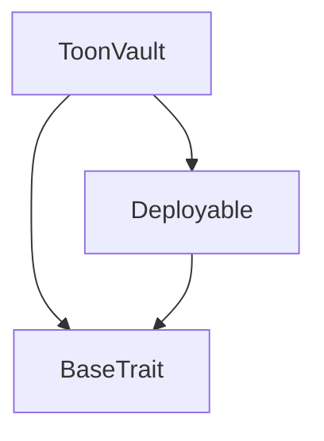
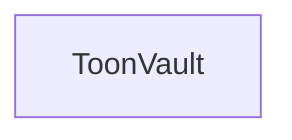

# Tact compilation report
Contract: ToonVault
BoC Size: 9416 bytes

## Structures (Structs and Messages)
Total structures: 26

### DataSize
TL-B: `_ cells:int257 bits:int257 refs:int257 = DataSize`
Signature: `DataSize{cells:int257,bits:int257,refs:int257}`

### SignedBundle
TL-B: `_ signature:fixed_bytes64 signedData:remainder<slice> = SignedBundle`
Signature: `SignedBundle{signature:fixed_bytes64,signedData:remainder<slice>}`

### StateInit
TL-B: `_ code:^cell data:^cell = StateInit`
Signature: `StateInit{code:^cell,data:^cell}`

### Context
TL-B: `_ bounceable:bool sender:address value:int257 raw:^slice = Context`
Signature: `Context{bounceable:bool,sender:address,value:int257,raw:^slice}`

### SendParameters
TL-B: `_ mode:int257 body:Maybe ^cell code:Maybe ^cell data:Maybe ^cell value:int257 to:address bounce:bool = SendParameters`
Signature: `SendParameters{mode:int257,body:Maybe ^cell,code:Maybe ^cell,data:Maybe ^cell,value:int257,to:address,bounce:bool}`

### MessageParameters
TL-B: `_ mode:int257 body:Maybe ^cell value:int257 to:address bounce:bool = MessageParameters`
Signature: `MessageParameters{mode:int257,body:Maybe ^cell,value:int257,to:address,bounce:bool}`

### DeployParameters
TL-B: `_ mode:int257 body:Maybe ^cell value:int257 bounce:bool init:StateInit{code:^cell,data:^cell} = DeployParameters`
Signature: `DeployParameters{mode:int257,body:Maybe ^cell,value:int257,bounce:bool,init:StateInit{code:^cell,data:^cell}}`

### StdAddress
TL-B: `_ workchain:int8 address:uint256 = StdAddress`
Signature: `StdAddress{workchain:int8,address:uint256}`

### VarAddress
TL-B: `_ workchain:int32 address:^slice = VarAddress`
Signature: `VarAddress{workchain:int32,address:^slice}`

### BasechainAddress
TL-B: `_ hash:Maybe int257 = BasechainAddress`
Signature: `BasechainAddress{hash:Maybe int257}`

### Deploy
TL-B: `deploy#946a98b6 queryId:uint64 = Deploy`
Signature: `Deploy{queryId:uint64}`

### DeployOk
TL-B: `deploy_ok#aff90f57 queryId:uint64 = DeployOk`
Signature: `DeployOk{queryId:uint64}`

### FactoryDeploy
TL-B: `factory_deploy#6d0ff13b queryId:uint64 cashback:address = FactoryDeploy`
Signature: `FactoryDeploy{queryId:uint64,cashback:address}`

### Configuration
TL-B: `_ emissionCap:coins minWalletAgeDays:uint32 targetDailyActivity:uint32 rewardBaseActiveListener:coins rewardBaseGrowthAgent:coins rewardBaseArtistLaunch:coins rewardBaseTrendsetter:coins rewardBaseEarlyBeliever:coins rewardBaseDropInvestor:coins decayFactor:uint16 minThreshold:coins antiFarmingCoeff:uint16 = Configuration`
Signature: `Configuration{emissionCap:coins,minWalletAgeDays:uint32,targetDailyActivity:uint32,rewardBaseActiveListener:coins,rewardBaseGrowthAgent:coins,rewardBaseArtistLaunch:coins,rewardBaseTrendsetter:coins,rewardBaseEarlyBeliever:coins,rewardBaseDropInvestor:coins,decayFactor:uint16,minThreshold:coins,antiFarmingCoeff:uint16}`

### SetConfig
TL-B: `set_config#2bd0b755 config:Configuration{emissionCap:coins,minWalletAgeDays:uint32,targetDailyActivity:uint32,rewardBaseActiveListener:coins,rewardBaseGrowthAgent:coins,rewardBaseArtistLaunch:coins,rewardBaseTrendsetter:coins,rewardBaseEarlyBeliever:coins,rewardBaseDropInvestor:coins,decayFactor:uint16,minThreshold:coins,antiFarmingCoeff:uint16} = SetConfig`
Signature: `SetConfig{config:Configuration{emissionCap:coins,minWalletAgeDays:uint32,targetDailyActivity:uint32,rewardBaseActiveListener:coins,rewardBaseGrowthAgent:coins,rewardBaseArtistLaunch:coins,rewardBaseTrendsetter:coins,rewardBaseEarlyBeliever:coins,rewardBaseDropInvestor:coins,decayFactor:uint16,minThreshold:coins,antiFarmingCoeff:uint16}}`

### ClaimReward
TL-B: `claim_reward#f9d49f8b walletAddress:address rewardId:uint8 telegramId:uint64 walletAgeDays:uint32 hasVibeStreak:bool tipAmount:coins claimId:uint64 expiry:uint32 sigHigh:uint256 sigLow:uint256 referrerId:uint64 = ClaimReward`
Signature: `ClaimReward{walletAddress:address,rewardId:uint8,telegramId:uint64,walletAgeDays:uint32,hasVibeStreak:bool,tipAmount:coins,claimId:uint64,expiry:uint32,sigHigh:uint256,sigLow:uint256,referrerId:uint64}`

### MintAuthorized
TL-B: `mint_authorized#a976502b recipient:address amount:coins origin:address authorizedAt:uint32 = MintAuthorized`
Signature: `MintAuthorized{recipient:address,amount:coins,origin:address,authorizedAt:uint32}`

### MintSuccess
TL-B: `mint_success#1bb1cdbf recipient:address amount:coins origin:address = MintSuccess`
Signature: `MintSuccess{recipient:address,amount:coins,origin:address}`

### RewardClaimed
TL-B: `reward_claimed#81a35543 rewardId:uint8 recipient:address amount:coins = RewardClaimed`
Signature: `RewardClaimed{rewardId:uint8,recipient:address,amount:coins}`

### UpdateReserve
TL-B: `update_reserve#dded29fc amount:coins = UpdateReserve`
Signature: `UpdateReserve{amount:coins}`

### UpdateRegistry
TL-B: `update_registry#10401f27 newRegistry:address = UpdateRegistry`
Signature: `UpdateRegistry{newRegistry:address}`

### SetGovernance
TL-B: `set_governance#b788aa64 newGovernance:address = SetGovernance`
Signature: `SetGovernance{newGovernance:address}`

### SetOracleKey
TL-B: `set_oracle_key#59ac8ed6 newPublicKey:uint256 = SetOracleKey`
Signature: `SetOracleKey{newPublicKey:uint256}`

### TreasuryWithdraw
TL-B: `treasury_withdraw#79d47611 amount:coins recipient:address = TreasuryWithdraw`
Signature: `TreasuryWithdraw{amount:coins,recipient:address}`

### UpdateIdentityWeight
TL-B: `update_identity_weight#60799de2 wallet:address weight:int257 = UpdateIdentityWeight`
Signature: `UpdateIdentityWeight{wallet:address,weight:int257}`

### ToonVault$Data
TL-B: `_ owner:address registry:address governance:address oraclePublicKey:uint256 totalReserve:coins dailyEmitted:coins lastResetDay:uint32 halved:bool config:Configuration{emissionCap:coins,minWalletAgeDays:uint32,targetDailyActivity:uint32,rewardBaseActiveListener:coins,rewardBaseGrowthAgent:coins,rewardBaseArtistLaunch:coins,rewardBaseTrendsetter:coins,rewardBaseEarlyBeliever:coins,rewardBaseDropInvestor:coins,decayFactor:uint16,minThreshold:coins,antiFarmingCoeff:uint16} dailyClaimCount:uint32 usedClaimIds:dict<int, bool> lastClaimTimestamp:dict<int, int> claimCounts:dict<int, int> pairingCounts:dict<int, int> participantEntropy:dict<int, int> lastRewardTimestamp:dict<int, int> identityWeights:dict<address, int> dailyIdentityRewards:dict<int, coins> dailyClusterRewards:dict<int, coins> lifetimeClaimed:dict<int, bool> = ToonVault`
Signature: `ToonVault{owner:address,registry:address,governance:address,oraclePublicKey:uint256,totalReserve:coins,dailyEmitted:coins,lastResetDay:uint32,halved:bool,config:Configuration{emissionCap:coins,minWalletAgeDays:uint32,targetDailyActivity:uint32,rewardBaseActiveListener:coins,rewardBaseGrowthAgent:coins,rewardBaseArtistLaunch:coins,rewardBaseTrendsetter:coins,rewardBaseEarlyBeliever:coins,rewardBaseDropInvestor:coins,decayFactor:uint16,minThreshold:coins,antiFarmingCoeff:uint16},dailyClaimCount:uint32,usedClaimIds:dict<int, bool>,lastClaimTimestamp:dict<int, int>,claimCounts:dict<int, int>,pairingCounts:dict<int, int>,participantEntropy:dict<int, int>,lastRewardTimestamp:dict<int, int>,identityWeights:dict<address, int>,dailyIdentityRewards:dict<int, coins>,dailyClusterRewards:dict<int, coins>,lifetimeClaimed:dict<int, bool>}`

## Get methods
Total get methods: 12

## totalReserve
No arguments

## dailyEmitted
No arguments

## dailyClaimCount
No arguments

## isHalved
No arguments

## getConfig
No arguments

## currentEmissionCap
No arguments

## minWalletAgeDays
No arguments

## effectiveDailyCap
No arguments

## governance
No arguments

## walletClaimCount
Argument: rewardId
Argument: wallet

## isOneTimeClaimed
Argument: rewardId
Argument: wallet

## isClaimIdUsed
Argument: claimId

## Exit codes
* 2: Stack underflow
* 3: Stack overflow
* 4: Integer overflow
* 5: Integer out of expected range
* 6: Invalid opcode
* 7: Type check error
* 8: Cell overflow
* 9: Cell underflow
* 10: Dictionary error
* 11: 'Unknown' error
* 12: Fatal error
* 13: Out of gas error
* 14: Virtualization error
* 32: Action list is invalid
* 33: Action list is too long
* 34: Action is invalid or not supported
* 35: Invalid source address in outbound message
* 36: Invalid destination address in outbound message
* 37: Not enough Toncoin
* 38: Not enough extra currencies
* 39: Outbound message does not fit into a cell after rewriting
* 40: Cannot process a message
* 41: Library reference is null
* 42: Library change action error
* 43: Exceeded maximum number of cells in the library or the maximum depth of the Merkle tree
* 50: Account state size exceeded limits
* 128: Null reference exception
* 129: Invalid serialization prefix
* 130: Invalid incoming message
* 131: Constraints error
* 132: Access denied
* 133: Contract stopped
* 134: Invalid argument
* 135: Code of a contract was not found
* 136: Invalid standard address
* 138: Not a basechain address
* 1842: ToonVault: unknown reward ID
* 2528: ToonVault: wallet too new
* 4234: ToonVault: signed payload has expired
* 4630: ToonVault: only registry can authorize minting
* 8406: ToonVault: zero oracle key
* 11229: ToonVault: claimId already used
* 12206: ToonVault: tip too small
* 16587: ToonVault: claim cooldown active
* 26099: ToonVault: no Telegram identity
* 36280: ToonVault: insufficient reserve
* 40789: ToonVault: invalid rewardId
* 42423: ToonVault: unauthorized identity weight update
* 43615: ToonVault: invalid wallet address
* 44370: ToonVault: invalid oracle signature
* 52129: ToonVault: not owner
* 54161: ToonVault: one-time reward already claimed
* 55558: ToonVault: only registry can update config
* 57033: ToonVault: daily emission cap reached

## Trait inheritance diagram

## Contract dependency diagram

